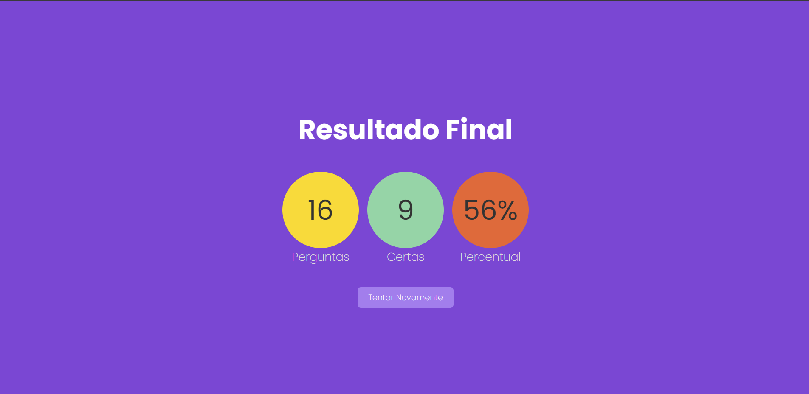

<h1 align="center">
    Monty Hall
</h1>

<p align="center">
 <a href="#-sobre-o-projeto">Sobre</a> •
 <a href="#-funcionalidades">Funcionalidades</a> •
 <a href="#-layout">Layout</a> • 
 <a href="#-como-executar-o-projeto">Como executar</a> • 
 <a href="#-tecnologias">Tecnologias</a>
</p>

## 💻 Sobre o projeto

O projeto é um Quiz que contém 16 perguntas genéricas do Show do Milhão com apenas uma resposta correta cada e 4 alternativas, ao final das 16 perguntas é mostrado uma estatística que leva em consideração a quantidade de perguntas e a quantidade de respostas corretas .

---

## ⚙️ Funcionalidades

- [x] O usuário pode escolher 1 das 4 alternativas e posteriormente será revelado a resposta, escolhendo a certa ou não.

- [x] Ao final das perguntas irá sugir um resultado final com as estatísticas gerais do desempenho do usuário.

---

## 🎨 Layout

O layout da aplicação:

### Web

<p align="center" style="display: flex; align-items: flex-start; justify-content: center;">

## Jogo

  

## Resultado Final

  

## 🚀 Como executar o projeto

Este projeto possui apenas FrontEnd.

### Pré-requisitos

Antes de começar, você vai precisar ter instalado em sua máquina as seguintes ferramentas:
[Git](https://git-scm.com), [Node.js](https://nodejs.org/en/).

Além de um editor de código como o [VSCode](https://code.visualstudio.com/).

#### 🎲 Rodando a Aplicação Web (Frontend)

```bash
# Clone este repositório
$ https://github.com/RenatoAlbuquerque/Quiz-Game.git
# Acesse a pasta do projeto no terminal/cmd
$ cd Quiz-Game
# Instale as dependências
$ npm install
# Execute a aplicação
$ npm start
# A aplicação iniciará na porta:3000 - acesse http://localhost:3000
```

---

## 🛠 Tecnologias

#### **Website** ([Next](https://vercel.com/solutions/nextjs))

- **[Typescript](https://www.typescriptlang.org/)**
- **[React Countdown Circle Timer](react-countdown-circle-timer)**

> Veja o arquivo [package.json]()

```

```
